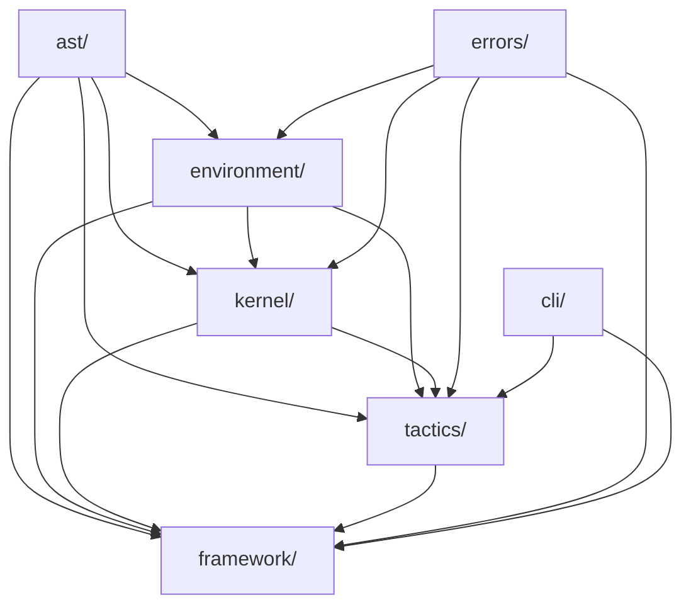
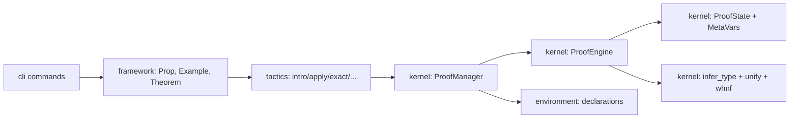

# Developer Guide

This guide explains the internal architecture of poussins and how the major modules interact.

For daily proof writing, see [Proof Author Guide](proof-author-guide.md).

## Local Setup

```bash
uv sync
uv run pytest
uv run ruff check .
uv run -m poussins --help
```

## Overview

This section gives the high-level structure of the repository and the main architectural boundaries.

### Repository Structure

```text
src/poussins/
  ast/           # Core expression/universe data types and utilities
  environment/   # Declaration store and predefined logical environment
  kernel/        # Goal state, type checking/unification, proof state transitions
  tactics/       # User-facing tactical transformations over ProofManager
  framework/     # High-level DSL wrappers: Prop, Example, Theorem
  cli/           # Command-line entry points and converters
  errors/        # Domain-specific exception hierarchy
example/         # Executable proof scripts
tests/           # Test suite
```

### Folder Dependency Hierarchy

The package is organized as a directed acyclic dependency graph. Each layer depends on lower layers, but no layer depends back on a higher layer.



In practice:

- `ast/` is the foundation layer. It defines expressions and utilities used everywhere.
- `errors/` is a shared support layer. It provides exception types used by the kernel, tactics, framework, and CLI.
- `environment/` builds on `ast/` and provides declarations for the kernel and framework.
- `kernel/` depends on `ast/`, `environment/`, and `errors/`, and is the core proof-state engine.
- `tactics/` depends on the kernel and framework-level concepts to transform goals.
- `framework/` builds on the kernel, tactics, environment, and ast to provide the user-facing DSL.
- `cli/` is the top-level entrypoint and depends on the framework and tactics layers.

This layout keeps the architecture layered and avoids circular imports.

### Design Principles

- Pure kernel state transitions: proof steps produce new immutable `ProofState` values.
- Thin tactics layer: tactics orchestrate `ProofManager`, while correctness is enforced by kernel checks.
- Friendly frontend DSL: `Prop`, `Example`, and `Theorem` hide kernel internals for users.
- Explicit environment model: declarations are registered in `Environment` and referenced by name.

### System Architecture



## Internals

This section explains how proof construction flows through the system and how the major layers are divided.

### End-to-End Proof Flow

1. `Example` or `Theorem` is created with a target expression.
2. `ProofManager` builds an initial goal/metavariable state through `ProofEngine.create_initial_state`.
3. A tactic generates a candidate assignment and optional subgoals.
4. Kernel validates typing and definitional equality, then returns next immutable state.
5. Session history keeps state snapshots for `undo()`.
6. On `Theorem.qed()`, the final proof term is extracted and added to `Environment`.

### Key Components

### AST (`ast/`)

- Defines expression forms (`EVar`, `EConst`, `EPi`, `EApp`, `ELam`, `EMetaVar`, ...).
- Provides substitution/free-variable and metavariable helper utilities.

### Environment (`environment/`)

- Stores declarations (`ConstantDeclaration`, `InductiveDeclaration`, `ConstructorDeclaration`, ...).
- `Environment.default()` preloads basic logical primitives (`True`, `False`, `And`, `Or`, `Not`) and `Nat`.

### Kernel (`kernel/`)

- `ProofState`: immutable snapshot of current goals + metavariable assignments.
- `ProofEngine`: validates and applies `close_goal` / `refine_goal` transitions.
- `ProofManager`: stable facade used by tactics and framework.
- `typecheck.py`: inference, normalization (`whnf`), and unification core.

### Tactics (`tactics/`)

- Tactical operations are small adapters that:
  - read current goal
  - construct proof term skeletons
  - call `ProofManager` for verified state transitions
- `constructor` resolves inductive constructors from the environment and delegates to `apply`.
- `cases` performs a structural split over an inductive hypothesis and produces branch subgoals, which are then verified through the existing kernel refinement flow.

### Framework (`framework/`)

- `Prop` offers ergonomic proposition syntax via operators.
- `ProofScript` supplies fluent method-style tactic API.
- `Example` validates anonymous proofs.
- `Theorem` validates and registers named proofs into the environment.

### CLI Surface

Main entrypoint:

```bash
uv run -m poussins <subcommand>
```

Available subcommands:
- `prove <file>`: batch execution
- `step <file> [--theorem NAME]`: step-wise execution
- `lean2py <file> [--output FILE]`
- `py2lean <file> [--output FILE]`

## Customization

This section explains how to extend the system safely without breaking the layering between framework, tactics, kernel, and environment.

### Extension Points

- Add a new tactic:
  - implement logic in `src/poussins/tactics/`
  - expose it through `framework/proof_script.py`
  - export it in `src/poussins/__init__.py`
  - add focused tests under `tests/`
- Add new logical constants/inductives:
  - extend environment declarations
  - ensure kernel typing/unification handles new cases

#### Public Import Policy

Keep the root `poussins` package small and user-oriented.

1. `poussins` should expose the proof-authoring surface only.
  - `Environment`
  - DSL wrappers such as `Prop`, `Nat`, and `Bool`
  - proof-script entry points such as `Example`, `Theorem`, and theorem-style aliases
2. Extension and implementation APIs should be imported from subpackages.
  - Use `poussins.framework` for extension bases such as `InductiveType` and `ProofScript`.
  - Use `poussins.tactics` for tactic functions.
  - Use `poussins.environment` for declaration classes.
  - Use `poussins.ast` and `poussins.kernel` for low-level expression and kernel APIs.
3. Do not re-export low-level AST nodes, kernel internals, or extension-only base classes from the root package unless they are intentionally being promoted to stable end-user API.

#### Adding A New Inductive Type

When adding a new user-facing inductive type such as `Bool` or `List`, split the work between `environment/` and `framework/`.

1. Add declarations in `src/poussins/environment/environment.py`.
  - Add one `InductiveDeclaration` for the inductive name itself.
  - Add one `ConstructorDeclaration` per constructor.
  - Register all of them in `Environment.default()`.
2. Keep `InductiveDeclaration.type` as the full type former of the inductive name.
  - Nullary inductives use a sort directly, for example `Nat : Type`.
  - Parameterized inductives use a Pi-shaped expression, for example `Eq : Π A : Type, A -> A -> Prop`.
3. If the type should be part of the public DSL, add a wrapper class in `src/poussins/framework/` by extending `InductiveType`.
  - Use `Environment` declaration names as the source of truth for the inductive name and constructor names.
  - Build `Expr` values in the wrapper, but do not make the wrapper depend on an `Environment` instance at runtime.
  - Keep the wrapper focused on ergonomic construction helpers such as `zero()`, `succ(...)`, `true()`, or `false()`.
4. Export the wrapper from `src/poussins/framework/__init__.py` and `src/poussins/__init__.py` if it is intended to be public.
5. Add focused tests for both the environment declarations and the wrapper helpers.

#### Tactic Implementation Rules

Tactics are thin adapters over `ProofManager`. Keep them narrow and do not move proof-state ownership out of the kernel facade.

1. A tactic function should take `ProofManager` as its first argument.
2. Use `ProofManager` operations such as `close_goal()`, `refine_goal()`, and `undo()` to change proof state.
3. It is acceptable to inspect the current goal through `manager.current_state` when computing the next step.
4. Do not mutate `ProofSession`, `ProofState`, goal lists, or metavariable tables directly.
5. Do not bypass `ProofManager` to call lower-level kernel transition code for normal tactic behavior.
6. Raise domain-specific errors such as `TacticError` with concrete messages when a tactic cannot proceed.
7. After adding a tactic function in `src/poussins/tactics/`, add the corresponding fluent wrapper method to `src/poussins/framework/proof_script.py`.
8. If the tactic is part of the public API, export it from `src/poussins/__init__.py`.
9. Add focused positive and negative tests under `tests/tactics/`.

### Quality Checklist For Changes

- New/changed tactic has positive and negative tests.
- Error messages are specific (`TacticError`, `Kernel*Error`, `FrameworkError`).
- Public exports are updated if API is intended to be public.
- Examples still run with `uv run python example/...`.

---

Back to [README](../README.md).
