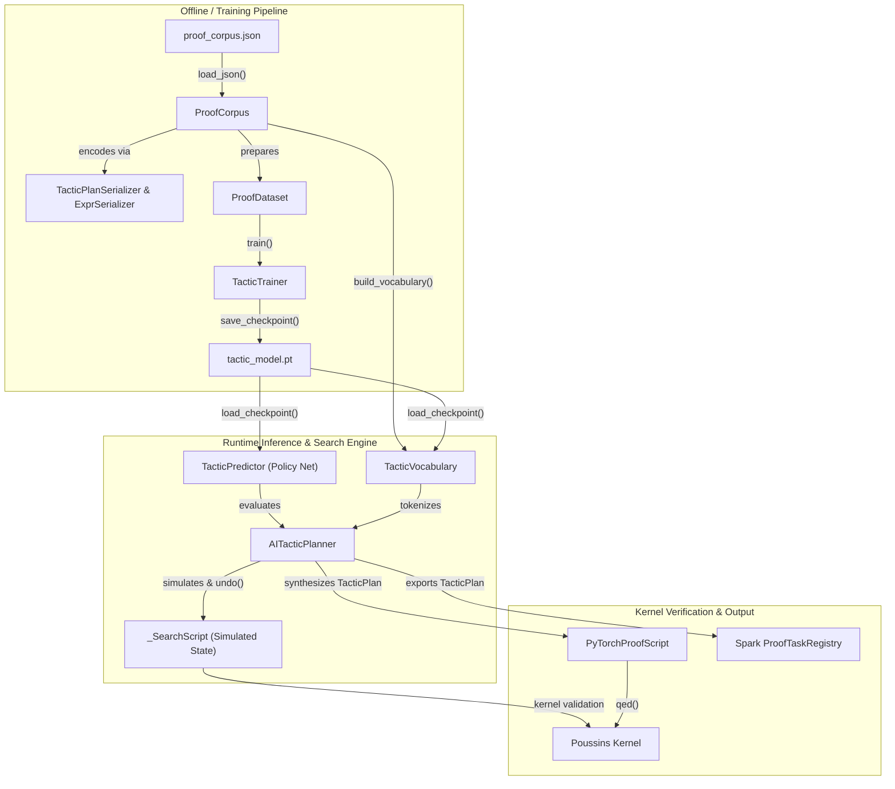
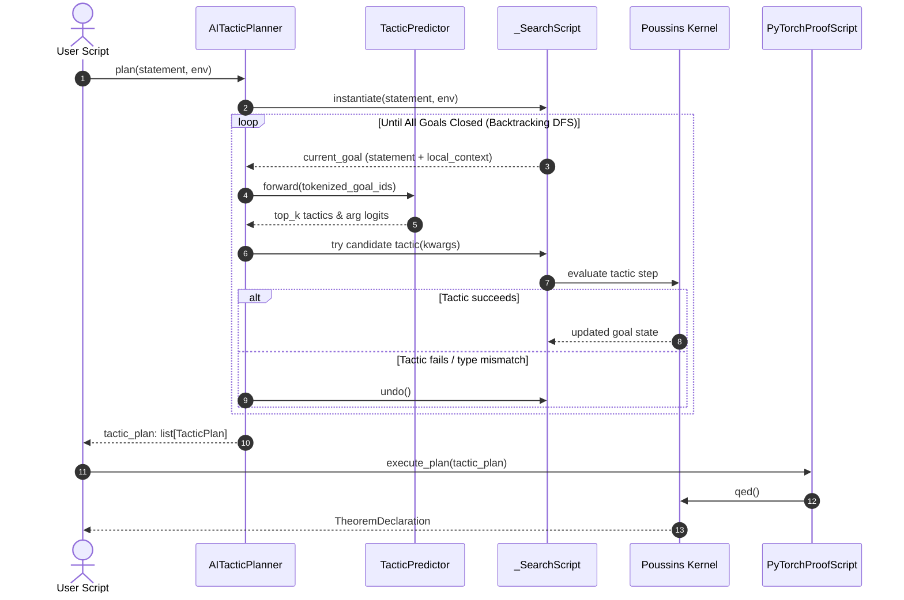

# PyTorch Integration Guide

This guide documents neural-driven proof tactic automation in Poussins using [PyTorch](https://pytorch.org/).

---

## Overview

In formal interactive theorem proving, finding an appropriate sequence of tactics (`TacticPlan`) to close a goal requires domain expertise and systematic search. While the Poussins kernel strictly enforces soundness and proof correctness, discovering the steps leading to a successful `qed()` can be automated with machine learning.

The Poussins PyTorch integration provides an AI-driven synthesis and automation layer. Given a goal statement and visible local hypotheses, a trained neural policy model predicts candidate tactics and hypothesis arguments. Combined with backtracking search, the integration synthesizes verified `TacticPlan` sequences and can directly close theorems or dispatch plans to distributed engines like Apache Spark.

### Key Capabilities

- **Neural Tactic Prediction**: Evaluates active goals and ranks viable tactics (`intros`, `constructor`, `exact`, `rfl`, etc.) and hypothesis bindings using dual-headed policy networks.
- **Automated TacticPlan Synthesis**: Explores proof states via backtracking depth-first search (`AITacticPlanner`), automatically generating complete `list[TacticPlan]` objects.
- **Universal Serialization**: Leverages canonical AST and tactic plan serializers (`TacticPlanSerializer` & `ExprSerializer`) to seamlessly preserve and decode arbitrary tactic arguments (expressions, tuples, sets).
- **Strict Kernel Soundness**: Tactics proposed by neural models are validated by the trusted Poussins kernel. Invalid candidates or ill-typed arguments trigger immediate backtracking with zero risk of unsound proofs.
- **Spark Interoperability**: Synthesized `TacticPlan` objects strictly adhere to the schema shared with the Spark integration, allowing AI-generated proofs to be dispatched across worker clusters.
- **Zero-Footprint Optionality**: Implemented under `[project.optional-dependencies]`. When PyTorch is not installed, core logic, DSL scripts, and Spark workflows run unaffected without runtime dependencies.

> [!NOTE]
> The PyTorch integration is a search and automation harness for assisting proof construction. The resulting proofs are always verified by the standard Poussins kernel and proof term extractor documented in the [Proof Author Guide](../proof-author-guide.md).

---

## Quick Start

This section walks through installing optional PyTorch dependencies, training a policy model on a bundled corpus, and running automated proof synthesis.

### Prerequisites

- **Python 3.12+**
- Project dependencies installed with the PyTorch extra:
  ```bash
  pip install -e '.[pytorch]'
  # or with uv:
  uv sync --extra pytorch
  ```

### Step 1: Train the Tactic Policy Model

The repository includes a sample propositional and arithmetic corpus along with a training script:

```bash
# Using standard Python
python example/pytorch/train.py

# Or using uv
uv run python example/pytorch/train.py
```

Expected output:
```text
Loading corpus from: example/pytorch/data/proof_corpus.json
Loaded 14 proof steps.
Built vocabulary with 25 tokens.
Training tactic model...
Training completed. Final loss: 0.0000, Accuracy: 100.0%
Checkpoint successfully saved to: example/pytorch/models/tactic_model.pt
```

### Step 2: Execute AI-Driven Proof Synthesis

Run the demonstration script that loads the trained model, synthesizes plans, and proves propositions:

```bash
# Using standard Python
python example/pytorch/example_ai_prove.py

# Or using uv
uv run python example/pytorch/example_ai_prove.py
```

Expected output:
```text
Loading trained AI model from: example/pytorch/models/tactic_model.pt

============================================================
Example 1: Proving P -> (Q -> (P /\ Q)) with AI TacticPlan
============================================================
Target Proposition: (Π _ : P, (Π _ : Q, ((And P) Q)))
Generated Tactic Plan by PyTorch AI:
  Step 1: intros({'names': ['h0', 'h1']})
  Step 2: constructor({})
  Step 3: exact({'expr_or_name': 'h0'})
  Step 4: exact({'expr_or_name': 'h1'})
Successfully Verified and Closed! Declared: ai_thm_and_intro: (Π _ : P, (Π _ : Q, ((And P) Q)))
```

---

## Component Architecture

The integration decouples offline model training and state representation from interactive search and proof script execution.

### Component Relationship Diagram



### AI-Driven Synthesis & Proof Lifecycle



---

## Component Reference

The core integration code resides under `src/poussins/integration/` and `src/poussins/integration/pytorch/`. The table below outlines each module's role:

| Component | Module | Execution Context | Description |
|---|---|---|---|
| `TacticPlanSerializer` | `serializer.py` | Shared | Canonical serializer/deserializer for `TacticPlan` and complex `TacticArg` payloads. |
| `ExprSerializer` | `serializer.py` | Shared | Canonical JSON serializer/deserializer for AST `Expr` trees. |
| `TacticVocabulary` | `pytorch/model.py` | Model / Planner | Maps AST syntactic tokens and tactic identifiers to discrete IDs. |
| `TacticPredictor` | `pytorch/model.py` | Model / Planner | Neural policy network predicting tactic distributions and hypothesis argument ranks. |
| `ProofStep` | `pytorch/dataset.py` | Data | Value object recording goal statements, hypothesis types, and tactic invocations. |
| `ProofCorpus` | `pytorch/dataset.py` | Data | Manages serializable collections of `ProofStep` objects. |
| `ProofDataset` | `pytorch/dataset.py` | Training | PyTorch `Dataset` providing tensor batches for training. |
| `TacticTrainer` | `pytorch/trainer.py` | Training | Orchestrates model optimization, loss tracking, and `.pt` checkpoint persistence. |
| `AITacticPlanner` | `pytorch/planner.py` | Inference | Tree search planner synthesizing verified sequences of `TacticPlan`. |
| `PyTorchProofScript` | `pytorch/proof_script.py` | Scripting | Fluent `ProofScript` variant supporting `auto_prove()` and plan execution. |

### 1. `TacticPlanSerializer` & `ExprSerializer`
- **Location**: [`src/poussins/integration/serializer.py`](file:///Users/kumo01/Projects/poussins/src/poussins/integration/serializer.py)
- **Role**: Provides lossless JSON serialization and deserialization for proof ASTs and tactic plans, ensuring compatibility across training corpora, network models, and execution backends.
- **Key Methods**:
  - `TacticPlanSerializer.encode_arg(val) / decode_arg(val)`: Safely encodes/decodes `Expr`, `tuple`, `set`, and `list` tactic arguments.
  - `TacticPlanSerializer.serialize(plan) / deserialize(json_str)`: String JSON round-trip for `TacticPlan`.
  - `ExprSerializer.to_dict(expr) / from_dict(data)`: Converts AST expressions to and from normalized dictionary trees.

### 2. `TacticVocabulary`
- **Location**: [`src/poussins/integration/pytorch/model.py`](file:///Users/kumo01/Projects/poussins/src/poussins/integration/pytorch/model.py)
- **Role**: Manages token dictionaries for neural sequence encoding and decoding.
- **Key Methods**:
  - `tokenize(text: str) -> list[str]`: Splits AST representations and hypotheses into clean syntactic tokens.
  - `add_tactic(tactic: str) -> int`: Dynamically registers new tactic names encountered in corpora.
  - `encode(tokens: list[str], max_len: int = 128) -> list[int]`: Converts token lists to padded integer tensors.
  - `to_dict() / from_dict(data)`: Serializes/deserializes vocabulary state for checkpointing.

### 3. `TacticPredictor`
- **Location**: [`src/poussins/integration/pytorch/model.py`](file:///Users/kumo01/Projects/poussins/src/poussins/integration/pytorch/model.py)
- **Role**: Neural policy network.
- **Architecture**:
  - `embedding`: Maps discrete token IDs to dense vectors (`embed_dim=64`).
  - `encoder`: Bidirectional GRU layer (`hidden_dim=128`, 2 layers) capturing goal context.
  - `tactic_head`: Multi-layer perceptron outputting classification logits over tactics.
  - `arg_head`: Multi-layer perceptron ranking the probability of selecting local hypothesis indices.

### 4. `ProofStep`, `ProofCorpus`, & `ProofDataset`
- **Location**: [`src/poussins/integration/pytorch/dataset.py`](file:///Users/kumo01/Projects/poussins/src/poussins/integration/pytorch/dataset.py)
- **Role**: Data abstraction layer for supervised learning.
- **Key Methods**:
  - `ProofCorpus.load_json(path) / save_json(path)`: Persists proof traces in human-readable JSON format via `TacticPlanSerializer`.
  - `ProofCorpus.build_vocabulary() -> TacticVocabulary`: Extracts all distinct tokens and tactic names from stored proofs.
  - `ProofDataset(corpus, vocabulary)`: Generates `(input_ids, tactic_target, arg_target)` tuples for PyTorch `DataLoader`.

### 5. `TacticTrainer`
- **Location**: [`src/poussins/integration/pytorch/trainer.py`](file:///Users/kumo01/Projects/poussins/src/poussins/integration/pytorch/trainer.py)
- **Role**: Supervised training controller.
- **Key Methods**:
  - `train(dataset, epochs, batch_size) -> dict[str, list[float]]`: Runs training loop using AdamW and dual cross-entropy loss.
  - `save_checkpoint(path)`: Serializes model parameters, architecture metadata, and vocabulary into a `.pt` file.
  - `load_checkpoint(path, device="cpu") -> tuple[TacticPredictor, TacticVocabulary]`: Restores model and vocabulary for inference.

### 6. `AITacticPlanner`
- **Location**: [`src/poussins/integration/pytorch/planner.py`](file:///Users/kumo01/Projects/poussins/src/poussins/integration/pytorch/planner.py)
- **Role**: High-level proof search engine utilizing method introspection.
- **Key Methods**:
  - `suggest_tactics(goal, top_k=None) -> list[tuple[str, float]]`: Queries model for top candidate tactics with confidence scores for an interactive proof session.
  - `plan(statement: Expr, env=None) -> list[TacticPlan]`: Discovers and returns a complete, verified sequence of tactic calls.

### 7. `PyTorchProofScript`
- **Location**: [`src/poussins/integration/pytorch/proof_script.py`](file:///Users/kumo01/Projects/poussins/src/poussins/integration/pytorch/proof_script.py)
- **Role**: User-facing ProofScript frontend for executing AI plans.
- **Key Methods**:
  - `auto_prove(planner: AITacticPlanner) -> list[TacticPlan]`: Invokes planner and applies the resulting plan in one call.
  - `execute_plan(plan: list[TacticPlan]) -> None`: Replays an existing tactic plan.
  - `qed() -> TheoremDeclaration`: Verifies that all subgoals are closed and extracts the validated proof term.

---

## Basic Usage

The following example shows how to load a trained model, initialize the planner, synthesize a proof plan, and verify it:

```python
from __future__ import annotations

from pathlib import Path
from poussins import Environment, Prop
from poussins.integration.pytorch import (
    AITacticPlanner,
    PyTorchProofScript,
    TacticTrainer,
)

def main() -> None:
    # 1. Load trained policy model and vocabulary
    model_path = Path("example/pytorch/models/tactic_model.pt")
    model, vocab = TacticTrainer.load_checkpoint(model_path)

    # 2. Prepare environment and planner
    env = Environment.standard()
    planner = AITacticPlanner(model, vocab, env=env, max_depth=10, top_k=3)

    # 3. Define the theorem proposition: P -> (Q -> (P /\ Q))
    p, q = Prop("P", env), Prop("Q", env)
    theorem_prop = p >> (q >> (p & q))

    # 4. Synthesize proof plan using AI
    plan = planner.plan(theorem_prop.expr, env=env)
    print("Synthesized Plan:", plan)

    # 5. Execute plan and extract verified theorem declaration
    script = PyTorchProofScript(theorem_prop.expr, env, name="conjunction_intro")
    script.execute_plan(plan)
    decl = script.qed()

    print(f"Verified: {decl.name}: {decl.type}")

if __name__ == "__main__":
    main()
```

---

## Multi-Engine Integration: AI Search with Spark Verification

Because `AITacticPlanner` outputs standard `TacticPlan` objects, it integrates naturally with the [Spark Integration](spark.md). An AI agent can synthesize proof plans on a local driver, and Spark can distribute and verify large suites of dependent lemmas simultaneously:


```python
from poussins.integration.pytorch import AITacticPlanner, TacticTrainer
from poussins.integration.spark import ProofRunner, ProofTaskRegistry

# 1. AI synthesizes tactic plans
model, vocab = TacticTrainer.load_checkpoint("example/pytorch/models/tactic_model.pt")
planner = AITacticPlanner(model, vocab, env=env)

plan_lemma1 = planner.plan(lemma1_expr, env=env)
plan_lemma2 = planner.plan(lemma2_expr, env=env)

# 2. Register into Spark task registry
registry = ProofTaskRegistry()
registry.register_task("lemma1", lemma1_expr, tactic_plan=plan_lemma1)
registry.register_task("lemma2", lemma2_expr, tactic_plan=plan_lemma2)

# 3. Verify in parallel on Spark cluster
with ProofRunner() as runner:
    verified_env = runner.run(registry, env=env)
```

---

## Operational Notes & Troubleshooting

### Device Selection & Acceleration
By default, `TacticTrainer` and `AITacticPlanner` use `device="cpu"`. If running on Apple Silicon or NVIDIA GPUs:
```python
import torch

device = "mps" if torch.backends.mps.is_available() else ("cuda" if torch.cuda.is_available() else "cpu")
planner = AITacticPlanner(model, vocab, device=device)
```

### Common Error Scenarios

| Error | Root Cause | Solution |
|---|---|---|
| `PyTorchIntegrationError: PyTorch is required...` | The `torch` package is not installed in the active environment. | Install with `pip install 'poussins[pytorch]'` or `uv sync --extra pytorch`. |
| `PyTorchIntegrationError: Checkpoint not found at 'X'` | Model weight file `.pt` does not exist at specified path. | Run `python example/pytorch/train.py` to train and generate the checkpoint. |
| `PyTorchIntegrationError: AITacticPlanner failed to find a tactic plan` | Max search depth reached or model suggested unviable tactic sequence. | Increase `max_depth` (e.g. 20) or `top_k`, or retrain model with additional proof examples. |
| `PyTorchIntegrationError: Theorem 'X' cannot be closed: Proof is not finished` | `qed()` invoked while open subgoals remain in the proof state. | Ensure all goals are closed before calling `qed()`. |

---

## Related Documentation

- [Integration Guides Index](README.md)
- [Spark Integration Guide](spark.md)
- [Proof Author Guide](../proof-author-guide.md)
- [Developer Guide](../developer-guide.md)
