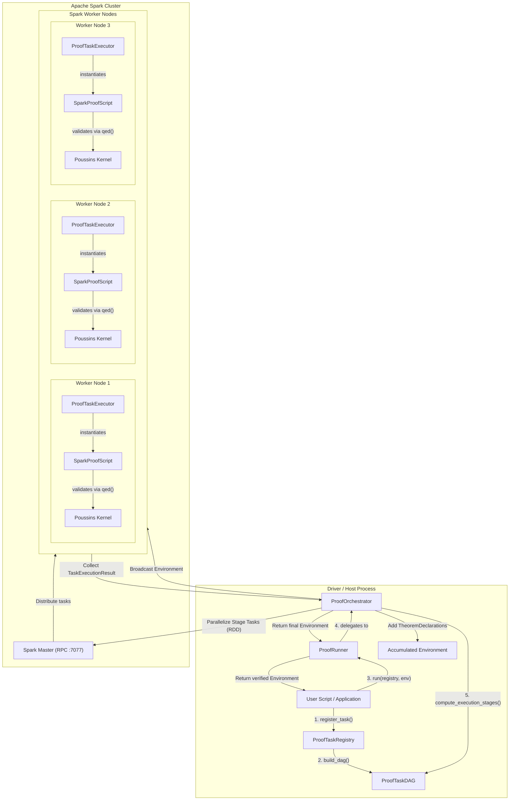
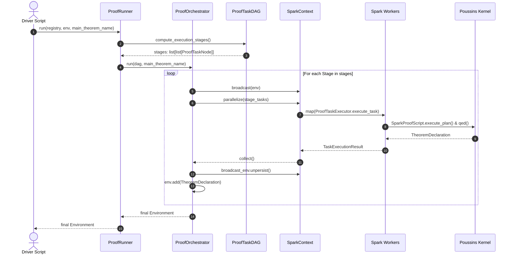
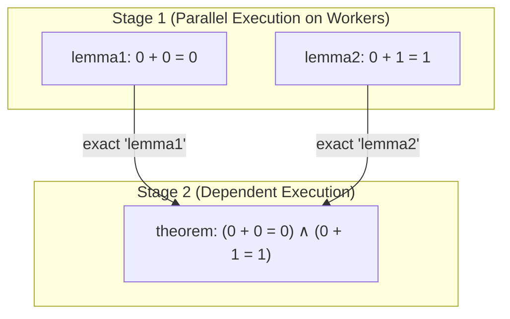

# Spark Integration Guide

This guide documents distributed proof execution in Poussins using [Apache Spark](https://spark.apache.org/).

---

## Overview

In formal verification, large mathematical proofs or complex system verifications naturally decompose into dozens or hundreds of modular lemmas and theorems. While an individual proof step is strictly sequential, independent lemmas can be verified concurrently.

The Poussins Spark integration provides a distributed execution layer that evaluates proof task graphs across an Apache Spark cluster. Instead of checking proofs within a single Python process, tasks are organized into a Directed Acyclic Graph (DAG) and executed across Spark workers according to their dependency order.

### Key Capabilities

- **Stage-Based Parallelism**: Tasks at the same dependency depth are partitioned and executed concurrently on worker nodes.
- **Strict Kernel Isolation**: Worker nodes execute proof tactic scripts independently and verify resulting proof terms against the trusted Poussins kernel before returning declarations to the driver.
- **Cumulative Logical Environment**: Verified `TheoremDeclaration` objects from upstream stages are aggregated on the driver and broadcast to downstream stages, allowing dependent proofs to safely reference preceding lemmas.
- **Fail-Fast Error Handling**: Any worker-side tactic failure or unclosed proof immediately propagates back to the driver as a `SparkIntegrationError`, preserving sound verification guarantees.

> [!NOTE]
> The Spark integration is a distribution harness for scaling verification workloads. Proof authors still write propositions and tactic scripts using the standard Poussins AST and tactic engine documented in the [Proof Author Guide](../proof-author-guide.md).

---

## Quick Start

This section walks through launching a local Spark cluster with Docker Compose and executing a distributed proof pipeline.

### Prerequisites

- **Docker & Docker Compose** (v2+)
- **Python 3.12+**
- Project dependencies installed with the Spark extra:
  ```bash
  pip install -e .[spark]
  # or with uv:
  uv sync --extra spark
  ```

### Step 1: Launch the Local Spark Cluster

The repository includes a preconfigured Docker Compose environment defining a Spark master and three worker nodes:

```bash
cd example/spark
docker compose up -d
```

Verify that all containers are healthy:

```bash
docker compose ps
```

You can inspect cluster status through the Spark Master Web UI at [http://localhost:8080](http://localhost:8080).

### Step 2: Run a Distributed Proof Task

From the repository root, run the bundled example script:

```bash
# Using standard Python
python example/spark/example1.py

# Or using uv
uv run python example/spark/example1.py
```

Expected output:
```text
=== 1. Initializing SparkSession for Local Spark Cluster ===
=== 2. Setting up Environment and Task Registry ===
=== 3. Executing Distributed Proof Solve ===
🎉 Success! Main theorem verified: TheoremDeclaration(name='main_theorem', ...)
=== 4. Stopping Spark Session ===
```

### Step 3: Tear Down the Cluster

When finished, stop the worker and master containers:

```bash
cd example/spark
docker compose down
```

---

## Component Architecture

The integration decouples driver-side DAG orchestration from worker-side proof execution.

### Component Relationship Diagram



### Distributed Execution Lifecycle



---

## Component Reference

The integration code resides under `src/poussins/integration/spark/`. The table below outlines each module's role:

| Component | Module | Execution Context | Description |
|---|---|---|---|
| `ProofTaskNode` | `task.py` | Shared | Immutable value object representing a single theorem/lemma task. |
| `ProofTaskDAG` | `task.py` | Driver | Validates task dependencies and sorts them into parallel execution stages. |
| `ProofTaskRegistry` | `registry.py` | Driver | Fluent builder for authoring, registering, and organizing proof tasks. |
| `ProofRunner` | `runner.py` | Driver | High-level facade managing `SparkSession` lifecycle and execution invocation. |
| `ProofOrchestrator` | `orchestrator.py` | Driver | Coordinates staged broadcast, task dispatch, error collection, and environment staging. |
| `ProofTaskExecutor` | `task_executor.py` | Worker | Isolated worker task harness returning structured `TaskExecutionResult` objects. |
| `SparkProofScript` | `proof_script.py` | Worker | Specialized `ProofScript` executing serialized tactic plans and yielding `TheoremDeclaration` terms. |

### 1. `ProofTaskNode`
- **Location**: [`src/poussins/integration/spark/task.py`](file:///Users/kumo01/Projects/poussins/src/poussins/integration/spark/task.py)
- **Role**: Dataclass representing an atomic unit of verification dispatched over the wire.
- **Fields**:
  - `name: str`: Unique identifier of the theorem or lemma.
  - `statement: Expr`: Proposition expression AST to be proven.
  - `tactic_plan: list[TacticPlan]`: Ordered list of `(tactic_name, kwargs)` pairs to reconstruct the proof.
  - `depends_on: list[str]`: Sequence of task names that must be verified and registered before this task executes.

### 2. `ProofTaskDAG`
- **Location**: [`src/poussins/integration/spark/task.py`](file:///Users/kumo01/Projects/poussins/src/poussins/integration/spark/task.py)
- **Role**: Manages the dependency graph of registered proof tasks.
- **Key Methods**:
  - `validate()`: Performs Depth-First Search (DFS) cycle detection to guarantee that dependencies form a valid DAG and that all referenced lemmas exist.
  - `compute_execution_stages() -> list[list[ProofTaskNode]]`: Computes parallel execution stages by iteratively resolving tasks whose in-degree (unresolved dependencies) equals zero.

### 3. `ProofTaskRegistry`
- **Location**: [`src/poussins/integration/spark/registry.py`](file:///Users/kumo01/Projects/poussins/src/poussins/integration/spark/registry.py)
- **Role**: User-facing registry for authoring proof tasks before submission.
- **Key Methods**:
  - `register_task(name, statement, tactic_plan, depends_on=None) -> ProofTaskNode`: Validates that `name` is unique and that specified dependencies are already known, then records the node.
  - `build_dag() -> ProofTaskDAG`: Assembles all registered tasks into a `ProofTaskDAG` instance ready for stage resolution.
  - `clear()`: Empties the registry.

### 4. `ProofRunner`
- **Location**: [`src/poussins/integration/spark/runner.py`](file:///Users/kumo01/Projects/poussins/src/poussins/integration/spark/runner.py)
- **Role**: Entry point for distributed verification.
- **Key Methods**:
  - `__init__(spark=None, app_name="poussins")`: Accepts an existing `SparkSession` or initializes a new one.
  - `run(registry, env=None, main_theorem_name="main_theorem") -> Environment`: Builds the DAG, creates a `ProofOrchestrator`, and executes all stages.
  - `stop()`: Shuts down the internal `SparkSession` if managed by the runner. Supports the Python Context Manager protocol (`with ProofRunner(...) as runner:`).

### 5. `ProofOrchestrator`
- **Location**: [`src/poussins/integration/spark/orchestrator.py`](file:///Users/kumo01/Projects/poussins/src/poussins/integration/spark/orchestrator.py)
- **Role**: Executes DAG stages sequentially on the Spark cluster while parallelizing tasks within each stage.
- **Workflow per Stage**:
  1. Broadcasts the current `Environment` to all workers via `sparkContext.broadcast(self.env)`.
  2. Distributes the stage's `ProofTaskNode` list across workers using `sparkContext.parallelize(stage)`.
  3. Maps `ProofTaskExecutor().execute_task(...)` on worker nodes.
  4. Collects results back to the driver with `.collect()`.
  5. Unpersists the broadcast variable from memory (`broadcast_env.unpersist()`).
  6. Checks every `TaskExecutionResult`: if any task failed, raises `SparkIntegrationError`.
  7. Inserts completed `TheoremDeclaration` objects into the local `Environment`.

### 6. `ProofTaskExecutor` & `SparkProofScript`
- **Location**: [`src/poussins/integration/spark/task_executor.py`](file:///Users/kumo01/Projects/poussins/src/poussins/integration/spark/task_executor.py) & [`proof_script.py`](file:///Users/kumo01/Projects/poussins/src/poussins/integration/spark/proof_script.py)
- **Role**: Worker-side execution engine.
- **Workflow**:
  1. Instantiates `SparkProofScript(node, env)`.
  2. Invokes `execute_plan()`, which maps each tuple in `tactic_plan` to its corresponding method on `ProofScript` (e.g. `rfl`, `exact`, `intro`).
  3. Invokes `qed()`, verifying that all goals are closed and extracting the kernel `proof_term`.
  4. Returns a `TaskExecutionResult` containing the verified `TheoremDeclaration`.

---

## Basic Usage

The following example demonstrates how to set up an environment, register dependent lemmas, and execute verification on Spark.

```python
from __future__ import annotations

from pyspark.sql import SparkSession
from poussins import Environment, Nat, Prop
from poussins.integration.spark import ProofRunner, ProofTaskRegistry

def main() -> None:
    # 1. Initialize SparkSession (pointing to your cluster or local standalone master)
    spark = (
        SparkSession.builder
        .appName("Poussins-Spark-Verification")
        .master("spark://localhost:7077")
        .getOrCreate()
    )

    # 2. Use ProofRunner context manager
    with ProofRunner(spark) as runner:
        # 3. Create the base logical environment and task registry
        env = Environment.standard()
        registry = ProofTaskRegistry()

        # 4. Formulate the proposition statement: 0 + 0 = 0
        zero_eq_zero = Prop(
            Nat.eq(Nat.add(Nat.zero(), Nat.zero()), Nat.zero())
        ).expr

        # 5. Register an independent base lemma (Stage 1)
        registry.register_task(
            name="lemma_base",
            statement=zero_eq_zero,
            tactic_plan=[
                ("rfl", {})
            ],
        )

        # 6. Register the main theorem dependent on lemma_base (Stage 2)
        registry.register_task(
            name="main_theorem",
            statement=zero_eq_zero,
            tactic_plan=[
                ("exact", {"expr_or_name": "lemma_base"})
            ],
            depends_on=["lemma_base"],
        )

        # 7. Execute the DAG across the cluster
        verified_env = runner.run(
            registry=registry,
            env=env,
            main_theorem_name="main_theorem",
        )

        # 8. Query the verified theorem declaration from the updated environment
        theorem_decl = verified_env.get("main_theorem")
        print(f"Verified: {theorem_decl.name}: {theorem_decl.type}")

if __name__ == "__main__":
    main()
```

---

## Multi-Stage Parallel Execution

When multiple lemmas do not depend on each other, `ProofTaskDAG` places them into the same execution stage. Spark distributes these tasks simultaneously across available worker cores.

Consider the scenario implemented in [`example/spark/example2.py`](file:///Users/kumo01/Projects/poussins/example/spark/example2.py):
- `lemma1`: proves $0 + 0 = 0$
- `lemma2`: proves $0 + 1 = 1$
- `theorem`: proves $(0 + 0 = 0) \land (0 + 1 = 1)$, depending on both `lemma1` and `lemma2`



```python
registry = ProofTaskRegistry()

# Independent lemmas execute in parallel in Stage 1
registry.register_task(
    name="lemma1",
    statement=lemma1_prop.expr,
    tactic_plan=[("rfl", {})],
)
registry.register_task(
    name="lemma2",
    statement=lemma2_prop.expr,
    tactic_plan=[("rfl", {})],
)

# Conjunction theorem executes in Stage 2
registry.register_task(
    name="theorem",
    statement=(lemma1_prop & lemma2_prop).expr,
    tactic_plan=[
        ("constructor", {}),
        ("exact", {"expr_or_name": "lemma1"}),
        ("exact", {"expr_or_name": "lemma2"}),
    ],
    depends_on=["lemma1", "lemma2"],
)

verified_env = runner.run(registry, env, main_theorem_name="theorem")
```

When `runner.run()` executes:
1. `compute_execution_stages()` outputs `[['lemma1', 'lemma2'], ['theorem']]`.
2. Stage 1 distributes `lemma1` and `lemma2` across workers concurrently.
3. Upon completion, both declarations are merged into the driver's `Environment`.
4. Stage 2 distributes `theorem` with the enriched environment, enabling `exact("lemma1")` and `exact("lemma2")` to succeed.

---

## Operational Notes & Troubleshooting

### Python Version Compatibility
Ensure that Python versions on driver and worker containers match. In the provided Docker Compose configuration, workers use `python3.14`:
```yaml
environment:
  - PYSPARK_PYTHON=python3.14
  - PYSPARK_DRIVER_PYTHON=python3.14
```
If you encounter `Python version mismatch: driver X.Y != worker A.B`, align the Python executable in your local driver environment or set `PYSPARK_PYTHON` accordingly.

### Cluster Networking & Ports
- **Spark Master RPC** (`7077`): Port used by the driver to submit jobs via `spark://localhost:7077`.
- **Spark Web UI** (`8080`): Web dashboard showing worker connectivity, active stages, and task metrics.
- Ensure ports `7077` and `8080` are not blocked by local firewalls or conflicting services.

### Common Error Scenarios

| Error | Root Cause | Solution |
|---|---|---|
| `SparkIntegrationError: Dependency 'X' ... is not registered` | A task references a dependency not yet added to the registry. | Register dependency tasks before dependent tasks. |
| `SparkIntegrationError: Circular dependency detected` | Cycle detected in task graph (e.g. $A \to B \to A$). | Remove recursive or mutual dependencies in the task plan. |
| `SparkIntegrationError: Proof task 'X' failed at stage N` | A tactic failed on worker or goal was left unclosed. | Verify tactic arguments and test the proof locally using single-process `Theorem`. |
| `Cannot connect to spark://localhost:7077` | Docker cluster is stopped or port 7077 is unmapped. | Run `docker compose ps` in `example/spark` and verify container health. |

---

## Related Documentation

- [Integration Guides Index](README.md)
- [Proof Author Guide](../proof-author-guide.md)
- [Developer Guide](../developer-guide.md)
